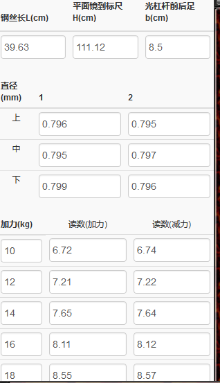
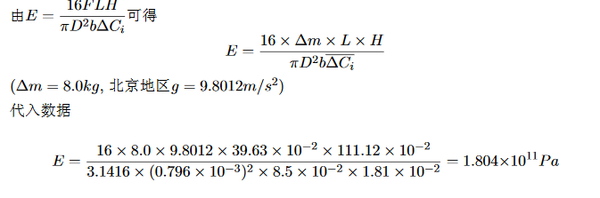
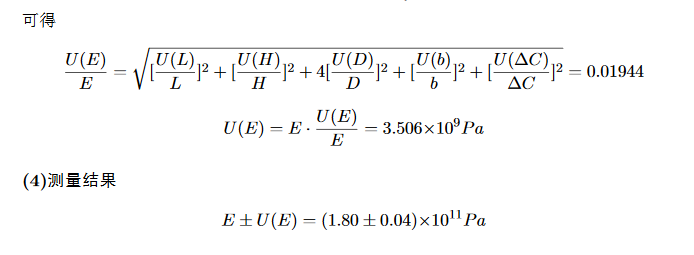
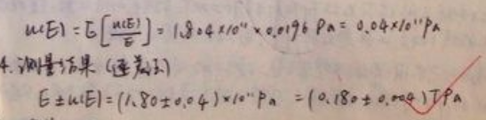

# 1010113测试报告

### 后端测试

通过python的单元测试框架对计算函数进行了测试，测试全部通过。

### 前端测试

从前端输入数据进行测试，计算结果及显示效果均符合预期，测试结果如图所示：

* 输入数据

  

* 中间结果

  

* 最终结果

  

* 参考结果

  

### 发现的问题

* 当浏览器宽度小到一定程度时数据栏会遮住报告栏（不在侧面显示也不在下面显示），无法查看报告
* 关于加减力过程中的读数，应将一竖列作为一个tr，这样按tab键会跳到当前栏目的下一个数据项，更符合输入习惯