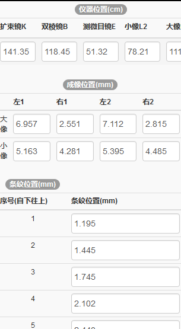
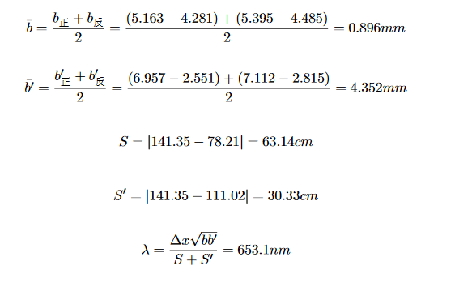
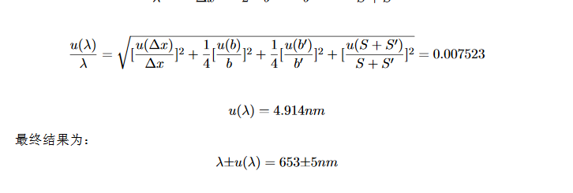
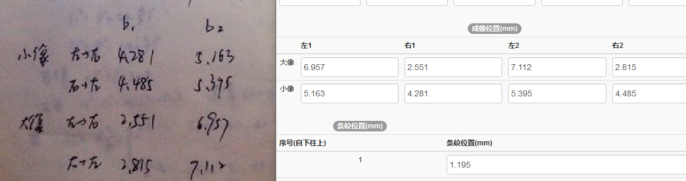

# 1080225测试报告

1080215的处理逻辑与1080114相同，使用了同样的数据进行测试，结果正确，于是没有更换新的测试截图。

### 后端测试

通过python的单元测试框架对计算函数进行了测试，测试全部通过。

### 前端测试

从前端输入数据进行测试，计算结果及显示效果均符合预期，测试结果如图所示：

* 输入数据

  

* 中间结果

  

* 最终结果

  

* 参考结果

  

### 发现的问题

* 

  如上图所示，左右两边表格的表头不是很对应，建议改为左边的形式，并且把小像至于上方，因为小像是b，大像是b‘，一般记录时习惯先记小像。

