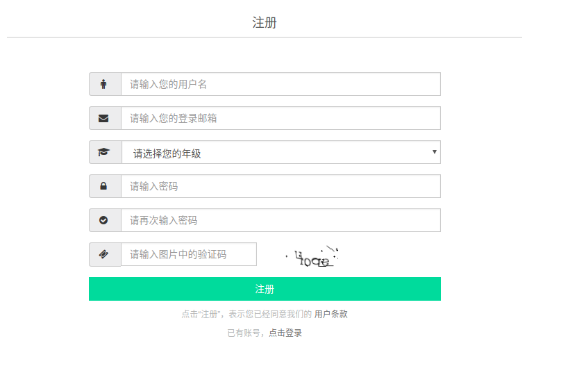

一开始接手项目的时候，因为未知的原因，服务器上数据库的用户数据全部丢失（包括表结构）。而整个网站的运行都是依赖用户登录的，因此第一步工作就是恢复数据库，但这花费了很长时间。

首先通过对laravel的学习了解到，laravel框架对于数据库的操作主要是通过定义model，然后使用 Eloquent ORM访问数据库的，因此我就寻找代码中的model，发现了User模型（定义在`app/Models/User.php`中），其中有且仅有这么一行对于数据表描述的代码：

```php
protected $fillable = [ 'name','email', 'password','student_id','avatar_path','sex','company','company_addr','introduction','birthday'];
```

这行代码非常让人疑惑，因为实际上网站的注册页面是这样的，`student_id` `sex`等信息在注册页面上并没有，并且还多了一个年级数据并没有在表中。这时候我就开始怀疑人生了。。。



于是我就想通过查找注册数据在服务器上处理的过程来确定数据是怎么样写入数据库的，进而了解数据库的结构。注册页面的地址是`http://server_name/register`，合理地推断注册数据也是通过这个路径提交的（实际上这里走了很大的弯路。。。）。

查找`app/routes.php`中定义的路由

```php
Route::post('/register', [
    'uses'    =>  'Auth\PhylabAuthController@postRegister',
    'middleware'    =>  'guest']);
```

根据代码，这里使用了`PhylabAuthController@postRegister`来处理用户注册，继续跟踪。在`postRegister`中，定义了注册数据的有效性检查：

```php
        $validatorRules = array(
                'name' => 'required|between:1,20|unique:users',
                'email' => 'required|email|max:255|unique:users',
                'student_id' => 'required|studentId|unique:users',
                'password' => 'required|confirmed|between:6,15',
            );
```

可以看到`student_id`是必须填写的数据，这里我就开始陷入了很久的沉思。。。网页上并没有提供这个数据，可是服务器端注册却使用了这个数据？？？


在这里陷了很久，后来查了前端代码，发现post提交到了另一个地址。。。

`/wecenter/?/account/ajax/register_process/`

发现这个以后就更懵逼了。。。为什么路由和控制器中都写了注册的代码，但注册数据却交给了wecenter来处理。。。这里我就猜测可能是一开始使用自己写的用户系统，但是因为后来使用了wecenter所以抛弃了原有的。于是开始查找wecenter的文档，通过安装wecenter，在测试数据库中新建了用户表，然后再把这个表导入到原有的数据库中。测试注册用户成功，但是不能登录，提示用户不存在。继续陷入沉思。。。

于是我又看了登录的前端代码，发现登录的数据提交给了laravel处理！？（再次黑人问号）。两套用户系统并存？？推测laravel的用户系统和wecenter的用户系统公用一套数据库，但是我并不知道它们是怎么交互的，关于这一部分上一届并没有留下任何文档。于是就陷入了僵局。

此处省略很久的思考人生。。。

最后在服务器上发现了一个数据库备份文件，研究了了一下发现，用户数据库是使用了wecenter的数据表，同时建立了一个视图包含这个表的部分数据，用来给laravel框架访问。于是导入这个备份文件，恢复了数据库。可以注册和登录了。

本来以为整个系统就已经恢复完成了，但是访问一下网站发现还有很多问题。。。

- wecenter只有文字，没有图片
- 物理实验部分没有内容
- 两套系统是如何交互的还并不清楚

wecenter缺少图片的问题：F12查看network，发现是找不到文件，路径不对。搜索整个项目文件，没有发现对于路径的设置。推测是存在数据库里，翻遍数据库发现了这部分设置。更改好以后可以显示出图片了。

物理实验部分没有内容：这个比较蛋疼，F12查看network，发现是internal server error。单步跟踪php代码执行好久，发现是数据库没有`Report`model中定义的列。这里我更懵逼了，上一届备份的文件里面没有这一列那他们是怎么运行的？？从服务器中的数据库dump出这部分数据，导入我的数据库中。这部分算完成了。

两套用户系统的交互：单步跟踪原生登录过程和wecenter登录过程，研究项目代码，发现是更改了wecenter的代码。用户会首先登录原生的用户系统，登录wecenter时，wecenter会向laravel框架请求一个凭证，laravel返回凭证让wecenter登录，这部分不需要用户操作，自动完成。

到这里心累的数据库恢复就完成了。。。